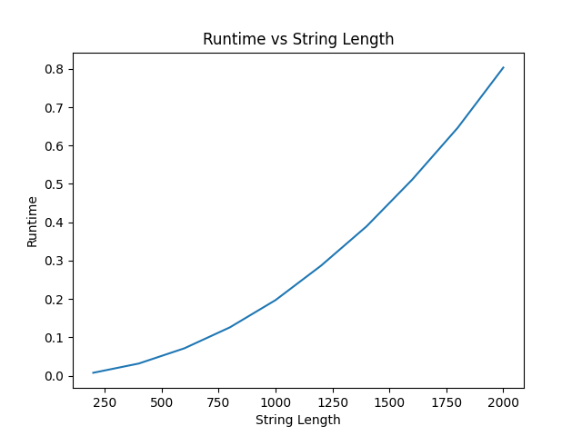

# Programming Assignment 3: Highest Value Longest Common Subsequence

This repo implements a dynamic programming algorithm for the Highest Value Longest Common Subsequence problem. Given a value for each character and two input strings, the program computes the maximum total value of any common subsequence and prints both that value and one subsequence that achieves it.

## Author

Dylan McGarry (UFID: 66318896)

## Input Format

Each input file begins with an integer k, which gives the number of characters that have assigned values. The next k lines each contain a character and its value. After that, the file contains two lines, each with one string. The strings are converted to lowercase before processing, and every character in the strings must appear in the value table.

Example:

```text
3
a 2
b 4
c 5
aacb
caab
```

## Output Format

For each input file, the program prints two lines. The first line is the maximum total value of a common subsequence of the two strings. The second line is one highest-value common subsequence that achieves that value.

Example:

```text
9
cb
```

## Setup

The main HVLCS solver uses only Python's standard library. The empirical runtime script uses matplotlib to generate the graph for the assignment questions, so the dependency can be installed with:

```text
pip3 install -r requirements.txt
```

## Running

To run the program on a single input file:

```text
python3 src/main.py <filename>
```

Example:

```text
python3 src/main.py data/example.in
```

You can also run the program on multiple input files in one command:

```text
python3 src/main.py <filename1> <filename2> <filename3>
```

Example:

```text
python3 src/main.py data/example.in data/example2.in
```

If no file path is provided, the program prints a usage message.

## Question 1: Empirical Comparison

The file test/test_runtime.py generates ten nontrivial test instances and measures the runtime of the dynamic programming solver on strings of lengths 200, 400, 600, 800, 1000, 1200, 1400, 1600, 1800, and 2000. In a representative run, the recorded runtimes were 0.007419 seconds, 0.030165 seconds, 0.069597 seconds, 0.126134 seconds, 0.197653 seconds, 0.286681 seconds, 0.389541 seconds, 0.510867 seconds, 0.651317 seconds, and 0.803264 seconds, respectively. The graph saved by the script appears below.



The curve grows faster than linearly and is consistent with the fact that the algorithm fills a two-dimensional table whose size depends on both input string lengths. Since the test strings are generated with the same length on both axes, the graph has the expected quadratic shape.

To generate the graph again:

```text
python3 test/test_runtime.py
```

## Question 2: Recurrence Equation

Let DP[i][j] denote the maximum total value of any common subsequence of the prefixes A[0..i-1] and B[0..j-1]. The base cases are DP[0][j] = 0 for all j and DP[i][0] = 0 for all i, because if either prefix is empty then the only common subsequence is the empty subsequence, whose total value is zero. For i > 0 and j > 0, if A[i - 1] = B[j - 1], then DP[i][j] = value(A[i - 1]) + DP[i - 1][j - 1]. Otherwise, DP[i][j] = max(DP[i - 1][j], DP[i][j - 1])`.

This recurrence is correct because when the last characters of the two prefixes match, an optimal highest-value common subsequence can end with that shared character, so its value is the value of the smaller optimal subproblem plus the value of the matching character. When the last characters do not match, any common subsequence must exclude one of them, so the best answer must come from dropping the last character of A or dropping the last character of B and taking whichever subproblem gives the larger total value.

## Question 3: Big-Oh

The following pseudocode computes the length of one highest-value longest common subsequence by first filling the dynamic programming table and then tracing backward through the table to count the characters that appear in the recovered solution.

```text
HVLCS-LENGTH(A, B, value):
    n <- length(A)
    m <- length(B)
    create table DP[0..n][0..m] filled with 0

    for i <- 1 to n:
        for j <- 1 to m:
            if A[i - 1] = B[j - 1]:
                DP[i][j] <- value[A[i - 1]] + DP[i - 1][j - 1]
            else:
                DP[i][j] <- max(DP[i - 1][j], DP[i][j - 1])

    i <- n
    j <- m
    length <- 0

    while i > 0 and j > 0:
        if A[i - 1] = B[j - 1] and DP[i][j] = value[A[i - 1]] + DP[i - 1][j - 1]:
            length <- length + 1
            i <- i - 1
            j <- j - 1
        else if DP[i - 1][j] >= DP[i][j - 1]:
            i <- i - 1
        else:
            j <- j - 1

    return length
```

The nested loops fill an (n + 1) x (m + 1) table, so the running time is O(nm). The traceback step takes at most O(n + m) time, which is dominated by the table construction, so the overall runtime remains O(nm). The space usage is also O(nm) because the full dynamic programming table is stored.

## Files

The file src/main.py is the command-line entry point. It reads input files, validates the format, calls the HVLCS solver, and prints the maximum value and a corresponding subsequence. The file src/hvlcs.py contains the dynamic programming implementation and the traceback logic used to recover one optimal subsequence. The file test/test_runtime.py generates larger random test instances, measures runtime, and writes the graph used for the empirical comparison. The data directory contains sample input files that match the expected format.
